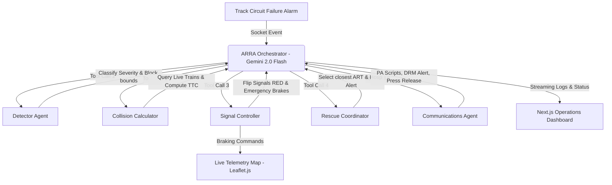

# ARRA — Autonomous Railway Response Architecture

> **Autonomous Incident Response Layer for Indian Railways**  
> Developed for **FAR AWAY 2026** — India's Biggest International Hackathon  
> Theme: *Railways* + *Agentic & Autonomous Systems* (Dual Theme)

---

## The Problem
Indian Railways operates one of the largest networks in the world, yet it lacks an integrated **autonomous incident response layer**. When a derailment, track discontinuity, or structural failure occurs, a single human operator at a local station or divisional headquarters is forced to execute a series of high-stakes operations sequentially:
1. Identify and classify the incident from telemetry/phone alerts.
2. Cross-reference active train schedules in the sector (via NTES/COA logs).
3. Issue emergency stop signals to block sections.
4. Dispatch the divisional Accident Relief Train (ART).
5. Alert nearest district hospitals and coordinate medical teams.
6. Generate safety notifications for the DRM and local passenger address announcements.

This manual chain of actions takes **8 to 15 minutes** to execute under pressure. The catastrophic **Balasore triple-train collision (2023, 293 fatalities)** occurred in a window of less than 10 minutes from track obstruction to impact—a stark demonstration that manual intervention is too slow. The technology to detect failures exists; the technology to respond autonomously does not.

---

## The Solution
**ARRA (Autonomous Railway Response Architecture)** provides that immediate, autonomous safety reaction layer. By linking track circuit telemetry directly to a **six-agent reasoning system** powered by Gemini 2.0 Flash tool-use orchestration, ARRA intercepts incoming hazards and coordinates a complete regional response in **under 70 seconds**—representing a **12.5x speedup** that saves lives.

When a track circuit breach occurs:
1. **Detector Agent** classifies the incident type and maps the affected block sections.
2. **Collision Calculator** pulls live train coordinates and projects Time-to-Collision (TTC) for approaching trains.
3. **Signal Controller** immediately transmits emergency halting signals to block tracks, braking trains to 0 km/h.
4. **Rescue Coordinator** determines the closest Accident Relief Train (ART) depot, calculates ETAs, and alerts local emergency hospitals.
5. **Communications Agent** drafts DRM incident briefs, bilingual station PA scripts (English + Hindi), and media statements simultaneously.
6. **Orchestrator Agent (Gemini 2.0 Flash)** handles the tool execution sequence and streams reasoning transparently to the divisional dashboard.

---

## System Architecture



---

## Tech Stack
*   **Frontend:** Next.js 14/15, Tailwind CSS, Leaflet.js (Interactive Map), WebSockets (Socket.io-client)
*   **Backend:** Python 3.12, Flask, Flask-SocketIO (Event-driven WebSockets), SQLite (Audit Database)
*   **Orchestrator:** Google Gemini 2.0 Flash (Function Calling / Tool use)
*   **Fallback LLM:** Groq Llama 3.3 70B (OpenAI-compatible tool calling loop)
*   **Fallback engine:** Autonomous rule-based execution engine (for offline/contingency simulations)

---

## Setup Instructions

### Prerequisites
*   Node.js (v20+ recommended)
*   Python (3.10+ recommended)

### 1. Environmental Configuration
Clone the repository and create a `.env` file in the root workspace directory:
```env
# ARRA System Environment Configuration
GEMINI_API_KEY="your-google-ai-studio-api-key-here"
GROQ_API_KEY="your-groq-api-key-here"
PORT=5000
HOST=127.0.0.1
```
*(If Gemini rate limits or fails, the orchestrator redirects to the Groq API. If both keys are absent, ARRA defaults to its offline autonomous rule-based simulation engine so it remains 100% testable).*

### 2. Backend Server Setup
In a terminal, navigate to the root directory and set up the Python environment:
```bash
# Set up virtual environment
python -m venv venv
venv\Scripts\activate

# Install requirements
pip install -r requirements.txt

# Run the backend Flask-SocketIO server
python backend/main.py
```
The Flask backend will launch at `http://127.0.0.1:5000`. It will initialize the SQLite database `backend/db/arra.db` and start simulated train telemetry movements.

### 3. Frontend Dashboard Setup
In a separate terminal, navigate to the `frontend` directory and set up the Next.js client:
```bash
# Navigate to frontend
cd frontend

# Install dependencies
npm install

# Start Next.js development server
npm run dev
```
Open `http://localhost:3000` in your browser to access the live operations telemetry dashboard.

---

## The 90-Second Demo Protocol
1. **Corridor Visual Inspection (15s):** Note the live trains crawling along the Howrah-Chennai corridor. Click on trains to see their running number, direction, speed, and nearest station. Signals along block sections are glowing green (CLEAR).
2. **Inject Incident (10s):** Open the Incident Injection Terminal, select "Derailment" at Balasore (BLS) with Severity Level 3, and press the big red **TRIGGER AUTONOMOUS RESPONSE** button.
3. **Autonomous Execution (45s):** Watch the terminal screen and agent panels. The six agents will fire:
    *   *Detector* locks the block boundary.
    *   *Collision Calculator* highlights trains at hazard.
    *   *Signal Controller* flips track signals to RED on the map. You will see approaching trains immediately decelerate and halt.
    *   *Rescue Coordinator* dispatches the ARMV and alerts the nearest hospital.
    *   *Communications Agent* drafts broadcasts.
4. **Result Audit (20s):** Observe the Stats Bar. The counter will stop near ~1.0s (representing 67s of simulated regional turnout dispatch, completing instantly). The final Operations Dossier pops up showing ready-to-broadcast Hindi/English PA announcements, DRM alerts, and public press statement logs.

---

